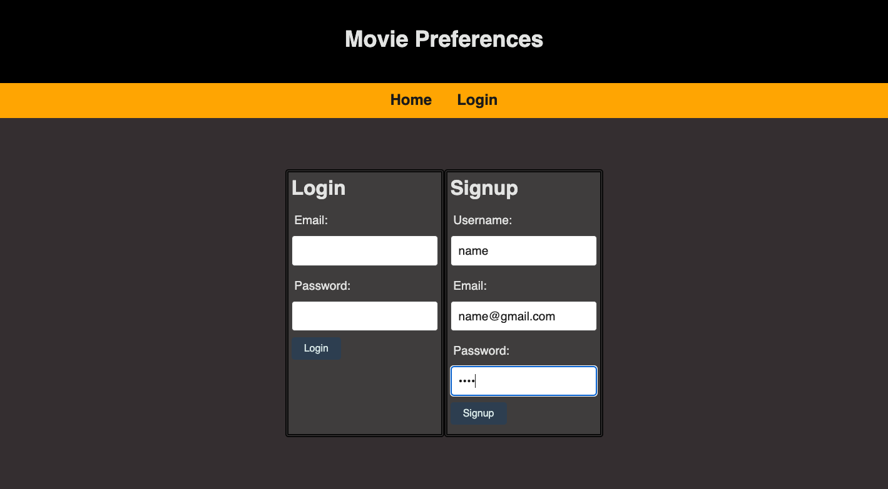
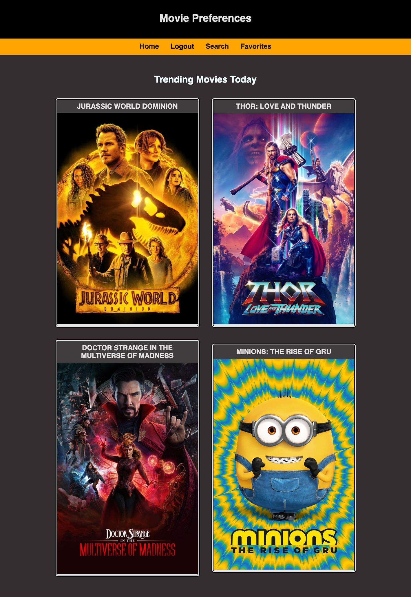
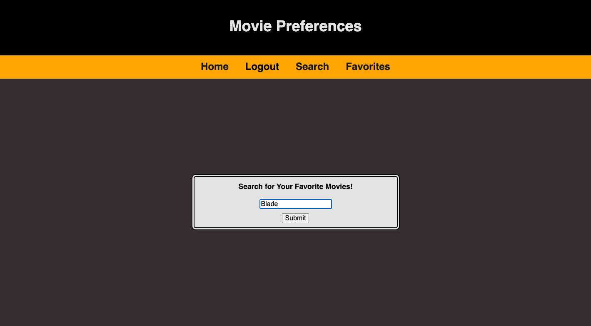
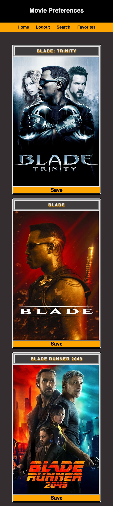
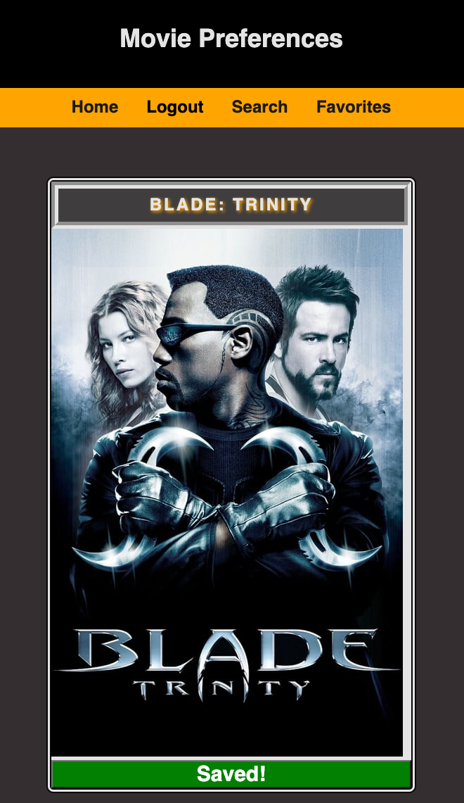
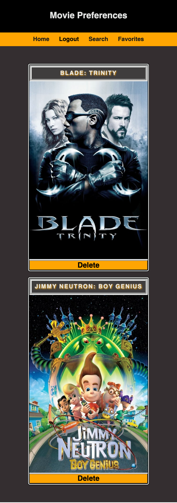
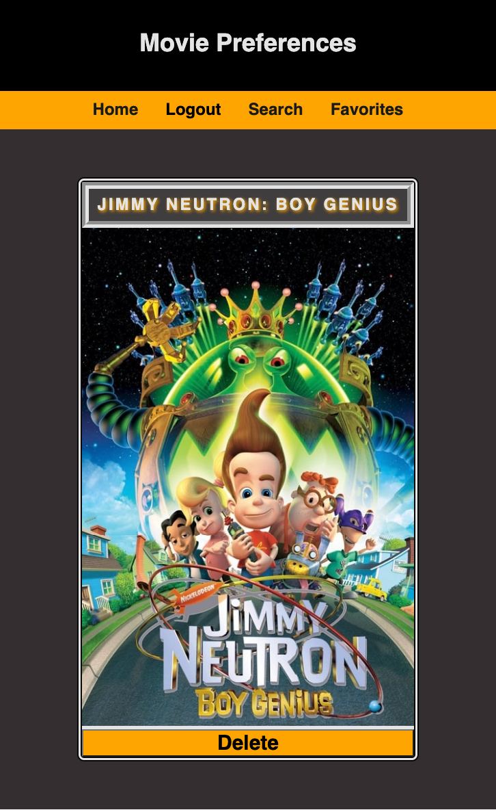

# Movie Preferences

## Table of Contents
- [Resources](#resources)

- [Installation Instructions](#installation)

- [User Story](#user-story)

- [Technologies Used](#technologies-used)

- [Screen Shots](#screen-shots)

- [Project Description](#project-description)

- [Authors and Acknowledgement](#authors-and-acknowledgement)

## Resources
- [REPOSITORY](https://github.com/okdavekk/movie-preferences)

- [HEROKU](https://shielded-waters-71876.herokuapp.com/)

## Installation
Run these commands in the root of the directory:

- npm i
- npm run db:create
- npm run seed
- npm start (app should run)

## User Story
As a movie enthusiast I want to navigate to a website that shows me the top trending movies for the week and allows me to log in SO THAT I can search for and save my favorite movies.

## Technologies Used
* axios: 0.27.2
* bcrypt: 5.0.1
* connect-session-sequelize: 7.1.4
* dotenv: 16.0.1
* express 4.18.1
* express-handlebars: 6.0.6
* express-session: 1.17.3
* express-sessions: 1.0.6
* mysql2: 2.3.3
* sequelize: 6.21.2
* Heroku
* GitHub

## Screen Shots
## Main Landing Page

## Login / Signup Page

## Logged in Main Landing Page

## Search Page

## Movie Search Results (Mobile View)

## Save Favorite

## Delete Buttons

## Deleted Movie

## Project Description
## 16 Project 2: Interactive Full-Stack Application:
Projects play a key role in your journey to becoming a full-stack web developer. As you enter the last phase of the boot camp, you’ll begin to apply for development jobs. If you want to land interviews, your portfolio must feature high-quality deployed examples of your work—-and you can use your finished projects for that very purpose.

As your first opportunity to show employers your collaborative skills and coding abilities, this particular project will be a focal point of your portfolio. Employers want to see what you can do, but they also want to see how you work with other developers. The more examples of deployed collaborative work you have in your portfolio, the more likely you are to get an interview and a job.

### Project Requirements
You and your group will use everything you’ve learned over the past six modules to create a real-world full-stack application that you’ll be able to showcase to potential employers. The user story and acceptance criteria will depend on the project that you create, but your project must fulfil the following requirements:

- Use Node.js and Express.js to create a RESTful API.
- Use Handlebars.js as the template engine.
- Use MySQL and the Sequelize ORM for the database.
- Have both GET and POST routes for retrieving and adding new data.
- Use at least one new library, package, or technology that we haven’t discussed.
- Have a folder structure that meets the MVC paradigm.
- Include authentication (express-session and cookies).
- Protect API keys and sensitive information with environment variables.
- Be deployed using Heroku (with data).
- Have a polished UI.
- Be responsive.
- Be interactive (i.e., accept and respond to user input).
- Meet good-quality coding standards (file structure, naming conventions, follows best practices for class/id naming conventions, indentation, quality comments, etc.).
- Have a professional README (with unique name, description, technologies used, screenshot, and link to deployed application).

### Presentation Requirements
Use this [project presentation template](https://docs.google.com/presentation/d/10QaO9KH8HtUXj__81ve0SZcpO5DbMbqqQr4iPpbwKks/edit?usp=sharing) to address the following:

- Elevator pitch: a one minute description of your application
- Concept: What is your user story? What was your motivation for development?
- Process: What were the technologies used? How were tasks and roles broken down and assigned? What challenges did you encounter? What were your successes?
- Demo: Show your stuff!
- Directions for Future Development
- Links to the deployed application and the GitHub repository. Use the [Guide to Deploy with Heroku and MySQL](https://coding-boot-camp.github.io/full-stack/heroku/deploy-with-heroku-and-mysql) on The Full-Stack Blog if you need a reminder on how to deploy to Heroku.

## Authors and Acknowledgement
Created by (AB order): Greg Chambers, Sergey Divachuk, James Giraldo, David Kemp, and Safwam Islam with help from many others.
